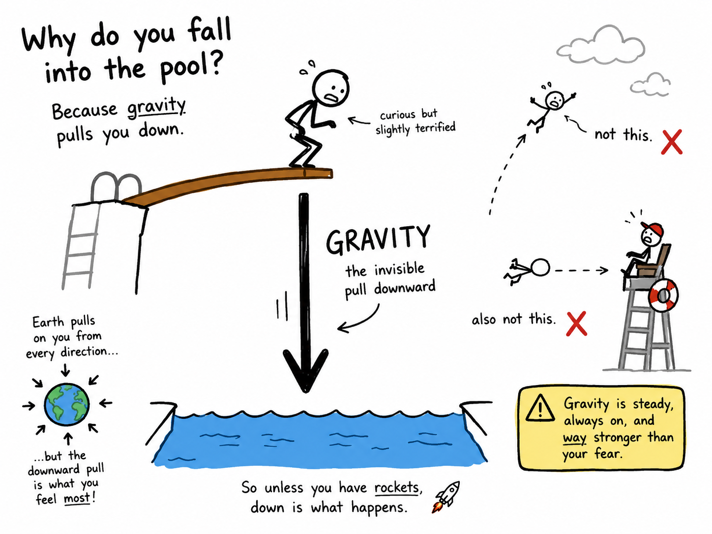

# Gravity

Imagine you are standing at the top of a diving board, looking down at the bright blue water below. You know exactly what will happen if you jump: you will fall toward the pool. You do not expect to drift upward into the sky or float sideways into the lifeguard chair. Something invisible, steady, and powerful is pulling you downward. That something is gravity.

Gravity is one of the most important forces in the universe. It keeps your feet on the ground, pulls raindrops from clouds, guides the Moon around Earth, and holds the planets in their paths around the Sun. Without gravity, life as we know it could not exist.

## What Is Gravity?

Gravity is the force of attraction between objects that have mass. Mass means the amount of matter in an object. You have mass, Earth has mass, a baseball has mass, and even a tiny grain of sand has mass. Because all these things have mass, they all have gravity.

Most objects around you have gravity that is far too weak for you to notice. A pencil and a book attract each other by gravity, but the pull is so tiny that it cannot overcome friction, air currents, or the strength of your hand. Earth, however, is enormous. Because it has so much mass, its gravitational pull is strong enough to hold people, oceans, buildings, and the atmosphere close to its surface.

When we say that something "falls," we mean that gravity is pulling it toward Earth. Drop a tennis ball, and it speeds downward. Let go of a leaf, and it also falls, though more slowly because air pushes against it. Gravity acts on both objects, but air resistance affects them differently.

## Gravity Pulls Toward the Center

Gravity does not simply pull "down" in some mysterious direction. Near Earth, gravity pulls objects toward Earth's center. Since we live on Earth's surface, that direction feels like down.

This explains something that may seem strange at first: people on the other side of the world are not upside down in any dangerous sense. They are pulled toward Earth's center just as you are. For them, their ground feels flat beneath their feet, and "down" points toward the center of Earth from where they stand.

## The Difference Between Mass and Weight

Mass and weight are closely related, but they are not the same thing.

Mass is the amount of matter in an object. Your mass would be the same whether you were on Earth, the Moon, or Mars.

Weight is the measure of how strongly gravity pulls on that mass. On Earth, you weigh more than you would on the Moon because Earth has more mass and stronger gravity. An astronaut who weighs 90 pounds on Earth would weigh only about 15 pounds on the Moon, but the astronaut's body has not lost most of its matter. The astronaut's mass is the same; the weight is different because the pull of gravity is different.

## Falling and Acceleration

When gravity pulls an object downward, the object does not merely move at one steady speed. If air resistance is small, the object accelerates, which means it moves faster and faster as it falls.

Near Earth's surface, falling objects accelerate at about 9.8 meters per second each second. That number means that after one second of falling, an object is moving about 9.8 meters per second; after two seconds, about 19.6 meters per second; after three seconds, about 29.4 meters per second, and so on, if we ignore air resistance.

You do not need to memorize every calculation yet, but you should understand the idea: gravity makes falling objects speed up.

## Why Do Some Things Fall More Slowly?

If you drop a stone and a feather at the same time, the stone reaches the ground first. At first glance, it may seem that gravity pulls harder on the stone. In one sense it does, because the stone has more mass. But the stone also requires more force to accelerate because of that greater mass. These two facts balance out in a surprising way: without air resistance, all objects near Earth would fall with the same acceleration.

Air resistance is the force of air pushing against a moving object. A feather has a large surface area compared with its weight, so air resistance slows it greatly. A stone cuts through the air more easily, so it falls quickly.

Astronauts on the Moon once dropped a hammer and a feather at the same time. Because the Moon has almost no atmosphere, there was almost no air resistance. The hammer and feather hit the ground together.

## Gravity Reaches Far Into Space

Gravity is not limited to Earth's surface. It reaches far out into space, growing weaker with distance but never suddenly stopping. Earth's gravity pulls on the Moon, and the Moon's gravity pulls on Earth. The Sun's gravity pulls on Earth and the other planets.

This is why planets orbit the Sun. Earth is always moving forward through space, but the Sun's gravity continually pulls it inward. The result is an orbit: Earth travels around the Sun instead of flying away in a straight line or falling directly into the Sun.

The Moon orbits Earth for a similar reason. It is moving forward, but Earth's gravity bends its path into a nearly circular orbit.

## The Law of Universal Gravitation

One of the greatest discoveries in science was made by Sir Isaac Newton in the 1600s. Newton realized that the same force that pulls an apple from a tree also helps keep the Moon in orbit around Earth. This was a bold idea: the heavens and the everyday world followed the same natural laws.

Newton's law of universal gravitation says that every object with mass attracts every other object with mass. The strength of this attraction depends mainly on two things:

1. How much mass the objects have.
2. How far apart the objects are.

More mass means stronger gravity. Greater distance means weaker gravity. This is why Earth's pull on you is strong, while the pull from a distant planet is much too weak for you to feel.

## Gravity and Everyday Life

Gravity shapes your day from the moment you wake up. It keeps your blanket on your bed and your cereal in your bowl. It gives water a downhill direction, which is why rivers flow from higher ground toward lower ground. It helps your muscles and bones grow strong because your body must work against it when you stand, walk, run, and climb stairs.

Engineers must understand gravity when they design bridges, buildings, airplanes, elevators, rockets, and roller coasters. Athletes use gravity when they jump, dive, ski, skateboard, or throw a ball. Even a simple game of catch depends on gravity: the ball travels forward from your throw while gravity pulls it downward, creating a curved path.

## Gravity Is Weak but Mighty

Gravity may seem like the strongest force because it rules so much of daily life. Yet compared with some other forces in nature, gravity is actually weak. A small magnet can lift a paper clip against the pull of the entire Earth. Your arm muscles can raise a backpack from the floor. In those cases, magnetic force or muscular force overcomes gravity.

Gravity matters so much because it always attracts and because it acts over enormous distances. On the scale of planets, stars, and galaxies, gravity becomes the great organizer of the universe.

## Why Gravity Matters

To understand gravity is to understand why the world has weight, why things fall, why the Moon stays near Earth, and why Earth remains near the Sun. Gravity connects the smallest ordinary actions, such as dropping a pencil, with the grand motions of planets and stars.

The next time you leap from a step, toss a ball, watch rain streak down a window, or see the Moon in the evening sky, remember that the same invisible force is at work in each case. Gravity is quiet, constant, and everywhere.

## Study Questions

1. What is gravity?
2. Why does Earth have a much stronger gravitational pull than a pencil or a book?
3. In what direction does gravity pull objects near Earth?
4. What is the difference between mass and weight?
5. Why would a person weigh less on the Moon than on Earth?
6. What does it mean for a falling object to accelerate?
7. Why does a feather fall more slowly than a stone on Earth?
8. What would happen if a hammer and a feather were dropped on the Moon at the same time, and why?
9. How does gravity help keep the Moon in orbit around Earth?
10. What did Isaac Newton realize about gravity?
11. What two main factors affect the strength of gravitational attraction between objects?
12. Give three examples of how gravity affects everyday life.
