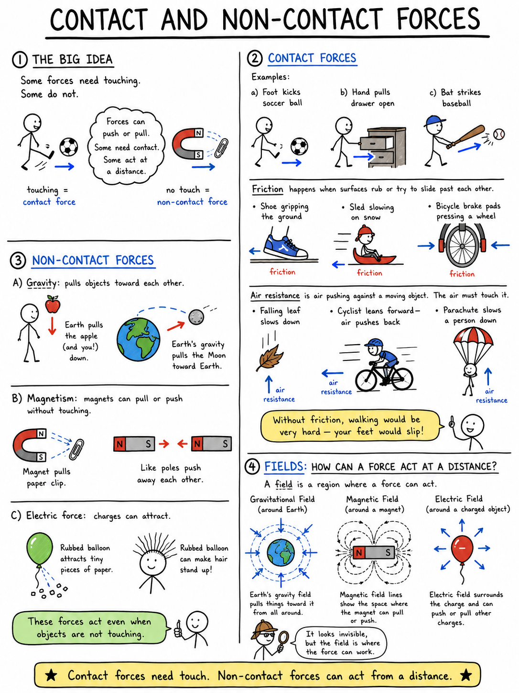
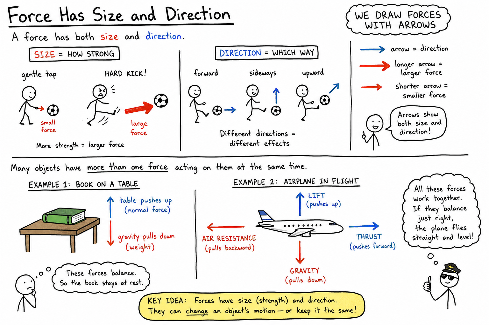
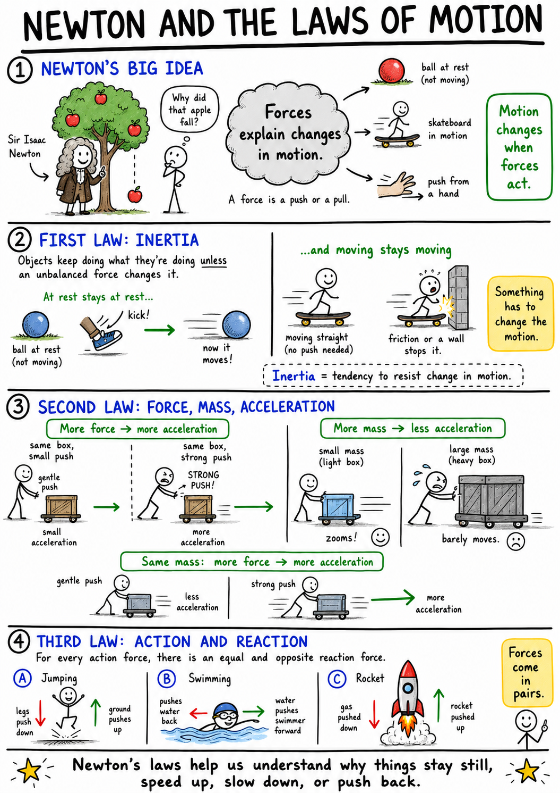

# Force

Imagine a soccer ball resting on the grass. It will not suddenly leap into the goal by itself. But if you kick it, the ball shoots forward. If the goalkeeper catches it, the ball stops. If another player bumps it from the side, its path changes.

Each of those moments involves a force.

A force is a push or a pull. Forces are everywhere: your hand pushes a door open, gravity pulls a dropped pencil downward, the ground pushes up on your feet, and a magnet pulls on a paper clip without even touching it. To understand motion, machines, sports, buildings, planets, and the human body, you must understand force.

Force is one of the great action words of science. It explains how objects start moving, stop moving, speed up, slow down, turn, stretch, squeeze, and sometimes break.

## What Is a Force?

A force is a push or a pull acting on an object.

When you push a chair under a desk, you apply a force. When you pull a wagon, you apply a force. When wind pushes against a sail, the wind applies a force. When gravity pulls a book from your hand toward the floor, gravity applies a force.

Forces can change an object's motion. A force can make an object start moving, stop moving, speed up, slow down, or change direction. A force can also change an object's shape. If you squeeze a sponge, stretch a rubber band, or bend a paper clip, you are using force to change shape.

Forces do not always produce visible motion. If you push against a brick wall, the wall may not move, but you are still applying a force. The wall pushes back on you, and the materials in the wall resist the change.

## Contact Forces

Some forces happen only when objects touch. These are called contact forces.

When your foot kicks a soccer ball, your foot must touch the ball. When your hand pulls a drawer open, your hand touches the handle. When a baseball bat strikes a baseball, the bat and ball touch for a very short time, but the force can be large.

Friction is another contact force. Friction acts when surfaces rub or try to slide past each other. It helps your shoes grip the floor, slows a sled on snow, and makes bicycle brakes work. Without friction, walking would be almost impossible because your feet would keep slipping.

Air resistance is also a contact force. Air pushes against moving objects. It slows a falling leaf, pushes against a cyclist, and makes a parachute useful. The air must touch the object for air resistance to act.

## Non-Contact Forces

Some forces act even when objects do not touch. These are called non-contact forces.

Gravity is a non-contact force. Earth pulls on you even though there is space between most of your body and Earth's center. Gravity pulls the Moon toward Earth and pulls Earth toward the Sun.

Magnetism can also act without direct touch. A magnet can pull on a paper clip from a short distance away. It can also push away another magnet if the poles are arranged a certain way.

Electric forces may act at a distance too. A rubbed balloon can attract small bits of paper or make your hair stand up because electric charges are interacting.

Non-contact forces may seem mysterious at first because nothing appears to be pushing or pulling. Scientists describe these forces using fields, such as gravitational fields, magnetic fields, and electric fields. A field is a region where a force can act.

## Measuring Force

In science, force is measured in newtons. The unit is named after Sir Isaac Newton, one of the most important scientists in history.

One newton is a fairly small force. Holding a small apple in your hand requires a force of about 1 newton upward to support it against gravity. A heavier object requires more newtons of force to hold, lift, or accelerate.

In a classroom, force can be measured with a spring scale. A spring scale stretches when a force pulls on it. The stronger the pull, the farther the spring stretches. Many spring scales are marked in newtons.

Using newtons helps scientists describe forces precisely. Instead of saying "a strong push" or "a gentle pull," they can measure and compare the size of forces.

## Force Has Size and Direction

A force has both size and direction.

The size of a force tells how strong it is. A hard kick gives a soccer ball a larger force than a gentle tap. The direction tells which way the force acts. A forward kick, a sideways kick, and an upward kick affect the ball differently because their directions are different.

Scientists often draw forces with arrows. The arrow points in the direction of the force. A longer arrow can show a larger force, and a shorter arrow can show a smaller force.

This is useful because many objects have more than one force acting on them at the same time. A book resting on a table has gravity pulling it downward and the table pushing it upward. A flying airplane has gravity pulling down, lift pushing up, thrust pushing forward, and air resistance pulling backward.

## Balanced Forces

Forces can be balanced or unbalanced.

Balanced forces are equal in size and opposite in direction. When forces are balanced, an object's motion does not change. If the object is still, it remains still. If it is already moving at a steady speed in a straight line, it keeps doing that.

Think of a tug-of-war where both teams pull with equal strength. The rope does not move toward either side. The forces are balanced.

A book sitting on a table is another example. Gravity pulls the book downward. The table pushes upward with an equal force. Because the forces are balanced, the book stays where it is.

Balanced forces do not mean no forces are acting. They mean the forces cancel each other.

## Unbalanced Forces

Unbalanced forces are not equal and opposite. When forces are unbalanced, an object's motion changes.

If one tug-of-war team pulls harder than the other, the rope moves toward the stronger team. If you kick a soccer ball, your foot provides an unbalanced force that starts the ball moving. If friction and air resistance slow the ball, those forces change its motion again.

Unbalanced forces can cause acceleration. In science, acceleration means any change in velocity. An object accelerates when it speeds up, slows down, or changes direction.

This means a car turning a corner is accelerating even if its speedometer number stays the same, because its direction is changing.

## Force, Mass, and Acceleration

Force, mass, and acceleration are closely connected.

If you push a toy car and a real car with the same force, the toy car will accelerate much more. The real car has far more mass, so it resists changes in motion much more strongly.

If you want the real car to accelerate as quickly as the toy car, you need a much larger force.

Older students often write Newton's second law of motion this way:

**force = mass x acceleration**

This means that the force needed depends on both the mass of the object and how much you want its motion to change. More mass requires more force for the same acceleration. More acceleration requires more force for the same mass.

You can feel this when you throw different balls. A tennis ball is easy to throw fast. A bowling ball is not. The bowling ball has more mass, so it requires more force to accelerate.

## Weight Is a Force

Weight is one important example of force.

Mass is the amount of matter in an object. Weight is the force of gravity pulling on that matter. On Earth, gravity pulls objects downward, so their weight acts downward.

Because weight is a force, it is measured in newtons in science. A student with more mass usually has more weight because Earth pulls on more matter. On the Moon, the same student would have the same mass but less weight because the Moon's gravity is weaker.

Remember: mass tells how much matter an object contains. Weight tells how strongly gravity pulls on that object.

## Friction: A Helpful and Troublesome Force

Friction is the force that resists motion between surfaces that touch.

Friction can be helpful. It lets your shoes grip the ground, allows tires to grip the road, and helps you hold a pencil. Brakes use friction to slow bicycles and cars.

Friction can also be troublesome. It makes machines heat up, wears down moving parts, and slows objects that engineers may want to move easily. That is why oil, grease, and ball bearings are used in many machines. They reduce friction so parts can move more smoothly.

Friction depends on the surfaces involved and how hard they are pressed together. Rough surfaces usually create more friction than smooth surfaces. A sled slides more easily on icy snow than on dry grass.

## Forces Can Change Shape

Forces do not only affect motion. They can also change shape.

If you stretch a rubber band, you apply a pulling force. If you squeeze a clay ball, you apply a pushing force. If you bend a metal spoon, twist a towel, or compress a spring, you are using force to change the object's shape.

Some objects return to their original shape after the force is removed. A spring or rubber band may do this if it is not stretched too far. This property is called elasticity.

Other objects keep their new shape. Clay stays squashed. A dented can may remain dented. If a force is too great, an object may crack, tear, or break.

## Forces in Everyday Life

Forces are part of nearly everything you do.

When you walk, your foot pushes backward on the ground, and the ground pushes you forward. When you open a door, you pull or push it. When you shoot a basketball, your hands apply a force that sends the ball upward and forward while gravity pulls it downward.

Engineers must understand forces to design safe bridges, buildings, cars, airplanes, and playgrounds. A bridge must withstand the weight of vehicles, the push of wind, and the shifting forces caused by moving traffic. A bicycle must be light enough to pedal but strong enough to handle bumps, braking, and turns.

Doctors and trainers think about forces too. Muscles pull on bones to move the body. Helmets, pads, and seat belts are designed to manage forces during collisions so the body is protected as much as possible.

## Newton and the Laws of Motion

Sir Isaac Newton studied how forces affect motion. His laws of motion became some of the most powerful ideas in science.

Newton's first law says that an object keeps doing what it is doing unless an unbalanced force acts on it. A resting object stays at rest, and a moving object keeps moving in a straight line at a steady speed unless something changes its motion.

Newton's second law connects force, mass, and acceleration. More force causes more acceleration, while more mass makes acceleration harder.

Newton's third law says that forces come in pairs. When one object pushes on another, the second object pushes back on the first. When you jump, your legs push down on the ground, and the ground pushes up on you.

You will study these laws more deeply later, but the beginning idea is simple: forces explain changes in motion.

## Why Force Matters

Force is the science of pushes and pulls, but that small definition opens a very large door. Forces explain why balls fly, why books rest on tables, why rockets rise, why bicycles stop, why bridges must be strong, and why your own muscles can move your body.

A careful student learns to ask: What forces are acting? Which direction do they act? Are they balanced or unbalanced? How do they change the object's motion or shape?

Once you can ask those questions, the world becomes easier to understand. Every moving object, every resting object, every stretched rubber band, every falling apple, and every step you take is part of the story of force.

## Study Questions

1. What is a force?
2. What are two ways a force can affect an object?
3. What is a contact force?
4. Give two examples of contact forces.
5. What is a non-contact force?
6. Give two examples of non-contact forces.
7. What unit do scientists use to measure force?
8. What tool can be used in class to measure force?
9. Why do scientists say that force has both size and direction?
10. What are balanced forces?
11. What happens to an object's motion when forces are balanced?
12. What are unbalanced forces?
13. What does acceleration mean in science?
14. How are force, mass, and acceleration connected?
15. Why is weight considered a force?
16. How can friction be helpful?
17. How can friction be troublesome?
18. Give two examples of forces changing an object's shape.
19. What does Newton's third law say about forces?
20. Give three examples of forces affecting everyday life.
