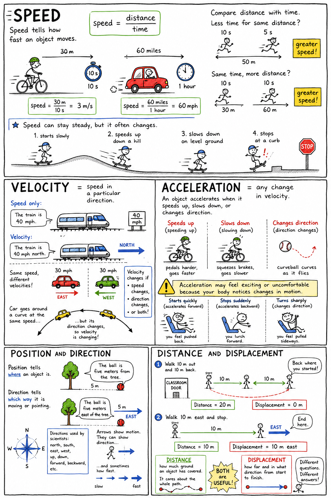

# Motion

Imagine you are watching a baseball game from the stands. The pitcher throws the ball. It races toward the batter, curves downward, cracks off the bat, and flies high into the outfield. The center fielder sprints back, turns, reaches up, and catches it.

In just a few seconds, you have seen motion in many forms: the ball speeding up, slowing down, changing direction, rising, falling, and stopping. You have also seen the players use their muscles to start, stop, and change their own motion.

Motion is one of the most familiar parts of life, but it is also one of the most important ideas in science. Every thrown ball, falling leaf, walking student, spinning wheel, flowing river, orbiting Moon, and racing rocket is part of the study of motion.

Motion means a change in position over time.

## What Is Motion?

An object is in motion when its position changes compared with a reference point.

A reference point is something you use to tell whether an object has moved. If your desk is the reference point and your pencil rolls away from it, the pencil is in motion. If a car passes a mailbox, the mailbox can be used as the reference point. If a runner moves from the starting line toward the finish line, the starting line helps us describe the runner's motion.

Motion always needs this kind of comparison. A book sitting on your desk is not moving compared with the desk. But the same book is moving compared with the Sun, because Earth is spinning and orbiting the Sun. Motion depends on what you compare it to.

This is why scientists describe motion carefully. They ask: Where is the object? What reference point are we using? How is the object's position changing over time?

## Position and Direction

Position tells where an object is. Direction tells which way it is moving or pointing.

If you say, "The ball is five meters from the tree," you have described the ball's distance from a reference point. But if you say, "The ball is five meters east of the tree," you have given a more complete position because you included direction.

Direction matters in motion. A student walking 10 meters north does not end up in the same place as a student walking 10 meters south. The distance may be the same, but the direction is different.

Scientists often use directions such as north, south, east, west, up, down, forward, and backward. In diagrams, they may use arrows to show motion. An arrow can show both where an object is moving and, sometimes, how fast it is moving.

## Distance and Displacement

Distance tells how much ground an object has covered. Displacement tells how far and in what direction an object is from its starting point.

Suppose you walk 10 meters from your classroom door down the hall, then turn around and walk 10 meters back. You have traveled a distance of 20 meters. But your displacement is 0 meters because you ended where you started.

Now suppose you walk 10 meters east and stop. Your distance is 10 meters, and your displacement is 10 meters east.

Distance cares about the whole path. Displacement cares about the change from start to finish. Both ideas are useful, but they answer different questions.

## Speed

Speed tells how fast an object moves.

To find speed, you compare distance with time. A cyclist who travels 30 meters in 10 seconds has a speed of 3 meters per second. A car that travels 60 miles in 1 hour has a speed of 60 miles per hour.

The basic idea is:

**speed = distance / time**

You do not need to solve difficult problems yet, but you should understand the meaning. If two runners cover the same distance, the one who takes less time has greater speed. If two runners run for the same amount of time, the one who covers more distance has greater speed.

Speed can stay steady, but it often changes. A skateboarder may start slowly, speed up down a hill, slow down on level ground, and stop at a curb.

## Velocity

Velocity is speed in a particular direction.

If you say a train is moving at 40 miles per hour, you have described its speed. If you say it is moving at 40 miles per hour north, you have described its velocity.

This difference is important because direction matters. Two cars may both travel at 30 miles per hour, but if one travels east and the other travels west, they have different velocities.

Velocity changes if speed changes, direction changes, or both change. A car going around a curve at the same speed is still changing velocity because its direction is changing.

## Acceleration

In everyday speech, people often use acceleration to mean speeding up. In science, acceleration means any change in velocity.

An object accelerates when it speeds up, slows down, or changes direction.

A bicycle accelerates when the rider pedals harder and speeds up. It also accelerates when the rider squeezes the brakes and slows down. A baseball thrown in a curve accelerates because its direction changes. A planet orbiting the Sun accelerates because its direction is always changing as it follows a curved path.

Acceleration may feel exciting or uncomfortable because your body notices changes in motion. When a car starts quickly, you feel pushed back into the seat. When it stops suddenly, you lurch forward. When it turns sharply, you feel pulled sideways. These feelings are clues that velocity is changing.

## Forces Cause Changes in Motion

Motion changes when unbalanced forces act on an object.

A force is a push or a pull. If a soccer ball is sitting still, it remains still until a force acts on it. A kick provides an unbalanced force that starts the ball moving. As the ball rolls, friction and air resistance act against its motion and slow it down.

Balanced forces do not change motion. A book resting on a table has gravity pulling downward and the table pushing upward. These forces are balanced, so the book stays still.

Unbalanced forces do change motion. A thrown ball changes motion because your hand applies force, gravity pulls downward, and air resistance pushes against its movement.

This idea is at the heart of motion: objects do not change their motion without a reason. That reason is an unbalanced force.

## Inertia

Inertia is an object's resistance to changes in motion.

An object at rest tends to stay at rest. An object in motion tends to keep moving in a straight line at a steady speed unless an unbalanced force acts on it.

You can feel inertia in a car. When the car starts suddenly, your body tends to remain at rest for a moment, so you feel pushed backward into the seat. When the car stops suddenly, your body tends to keep moving forward, which is why seat belts are so important.

Objects with more mass have more inertia. A bowling ball is harder to start moving than a tennis ball. Once the bowling ball is rolling, it is also harder to stop. Its greater mass gives it greater resistance to changes in motion.

## Types of Motion

Motion can take many forms.

Straight-line motion happens when an object moves along a straight path. A sprinter running down a lane or a train moving along a straight track are examples.

Curved motion happens when an object follows a bent path. A thrown ball, a turning bicycle, and the Moon orbiting Earth all move along curved paths.

Circular motion happens when an object moves around a center point. A spinning wheel, a ceiling fan, and a stone whirled on a string are examples.

Vibrating motion happens when something moves back and forth around a central position. A guitar string, a tuning fork, and a ruler twanged at the edge of a desk all vibrate.

Motion may be simple or complicated. A rolling wheel, for example, moves forward while also rotating. A thrown football may move forward, rise and fall, spin, and wobble all at once.

## Relative Motion

Motion can look different depending on where the observer is.

Imagine you are sitting on a train moving smoothly down the track. To you, your backpack on the seat beside you seems still. It is not moving compared with you or the train. But to a person standing beside the track, the backpack is moving quickly along with the train.

This is called relative motion. Motion is described compared with a chosen reference point or observer.

Relative motion explains why passengers on an airplane can walk down the aisle even though the airplane is racing through the sky. Compared with the airplane, the passenger walks slowly. Compared with the ground, the passenger is moving very fast.

## Graphing Motion

Scientists often use graphs to describe motion.

A distance-time graph shows how distance changes over time. If the line on the graph rises steadily, the object is moving at a steady speed. A steeper line means a greater speed because the object covers more distance in the same time.

If the line is flat, the object is not moving away from the reference point. Time is passing, but the distance is not changing.

Graphs are useful because they show patterns clearly. Instead of reading many numbers in a table, you can often look at the shape of a graph and tell whether an object was stopped, moving steadily, speeding up, or slowing down.

## Motion in Sports

Sports are full of motion.

In baseball, a pitcher tries to control the speed and direction of the ball. In basketball, a player must judge the force needed to send the ball upward and forward so gravity pulls it through the hoop. In soccer, players change speed and direction quickly to avoid defenders.

Good athletes understand motion even if they do not always use scientific words. They know how to speed up, slow down, turn, balance, jump, throw, and catch. Their brains and muscles constantly judge distance, direction, speed, and timing.

Science helps explain what skilled players learn through practice.

## Motion in Machines and Nature

Machines are designed to control motion. A bicycle changes the motion of your legs into the motion of wheels. A car engine turns fuel energy into motion. Brakes change motion into heat through friction. Gears, pulleys, levers, and wheels help guide or multiply motion.

Nature is also full of motion. Rivers flow downhill because gravity pulls water. Leaves flutter because air pushes them. Planets orbit because gravity bends their paths. Animals run, swim, fly, crawl, and leap by using muscles to apply forces.

Even things that seem still are often moving in hidden ways. Air molecules race around the room. Blood moves through your body. Earth spins once each day and travels around the Sun once each year.

## Why Motion Matters

Motion is not just about things moving from one place to another. It is a way of understanding change.

To study motion, you learn to describe position, reference points, distance, displacement, speed, velocity, and acceleration. You learn that forces change motion and that inertia resists changes in motion. You learn that motion can look different depending on the observer.

These ideas help explain sports, transportation, weather, machines, space travel, and the movements of your own body. Once you understand motion, you can see the world as a place of patterns: starts and stops, paths and turns, speeds and directions, pushes and pulls.

Motion is the language of change in the physical world.

## Study Questions

1. What is motion?
2. What is a reference point?
3. Why does motion need to be described compared with something else?
4. What is position?
5. Why is direction important when describing motion?
6. What is the difference between distance and displacement?
7. If you walk 10 meters down a hall and 10 meters back to your starting point, what is your distance and what is your displacement?
8. What is speed?
9. What is the basic formula for speed?
10. What is velocity?
11. How is velocity different from speed?
12. What does acceleration mean in science?
13. Give three ways an object can accelerate.
14. What kind of force changes an object's motion?
15. What is inertia?
16. How does mass affect inertia?
17. Give two examples of different types of motion.
18. What is relative motion?
19. What can a distance-time graph show?
20. Give three examples of motion in everyday life.
