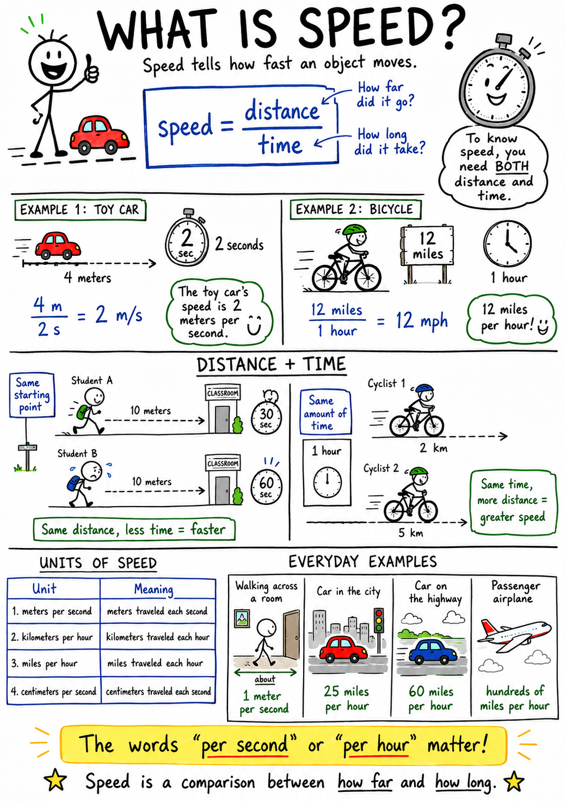

# Speed

Imagine two boys racing across a field after a loose soccer ball. Both start at the same line. One reaches the ball in six seconds. The other arrives three seconds later, breathing hard and laughing. They both traveled the same distance, but one covered that distance in less time.

The faster runner had greater speed.

Speed is one of the simplest ideas in science to notice and one of the most useful to measure. It helps us describe runners, bicycles, cars, trains, airplanes, rivers, storms, planets, and even light. Whenever something moves, we can ask an important question: how fast is it going?

Speed tells how much distance an object travels in a certain amount of time.

## What Is Speed?

Speed tells how fast an object moves.

More exactly, speed is the distance traveled divided by the time it takes to travel that distance. If a toy car travels 4 meters in 2 seconds, its speed is 2 meters per second. If a cyclist travels 12 miles in 1 hour, the cyclist's speed is 12 miles per hour.

The basic formula is:

**speed = distance / time**

This formula is not just a rule for math class. It expresses a powerful idea: speed compares motion with time. To know how fast something is moving, you need to know both how far it went and how long it took.

## Distance and Time

Speed always involves distance and time.

Distance tells how far an object travels. Time tells how long the trip takes. If the distance is large and the time is short, the speed is high. If the distance is small and the time is long, the speed is low.

Think of two students walking to the same classroom from the same starting point. If one student arrives in 30 seconds and the other arrives in 60 seconds, the first student walked faster. The distance was the same, but the time was different.

Now imagine two cyclists riding for the same amount of time. One travels 2 kilometers. The other travels 5 kilometers. The second cyclist had greater speed because he covered more distance in the same time.

Speed is a comparison between how far and how long.

## Units of Speed

Because speed compares distance and time, speed units include both distance units and time units.

Common units of speed include:

| Unit | Meaning |
| --- | --- |
| meters per second | meters traveled each second |
| kilometers per hour | kilometers traveled each hour |
| miles per hour | miles traveled each hour |
| centimeters per second | centimeters traveled each second |

In science class, meters per second is often useful. A student walking across a room might move at about 1 meter per second. A running student may move several meters per second.

In everyday life, people often use miles per hour or kilometers per hour for vehicles. A car on a city street might travel 25 miles per hour. A highway car may travel 60 miles per hour. A passenger airplane travels hundreds of miles per hour.

The words "per second" or "per hour" are important. They tell the time part of the comparison.

## Calculating Speed

To calculate speed, divide distance by time.

Suppose a remote-control car travels 20 meters in 5 seconds.

**speed = distance / time**

**speed = 20 meters / 5 seconds**

**speed = 4 meters per second**

This means the car travels an average of 4 meters each second.

Here is another example. Suppose a cyclist travels 15 kilometers in 3 hours.

**speed = 15 kilometers / 3 hours**

**speed = 5 kilometers per hour**

The cyclist's speed is 5 kilometers per hour.

The formula can be rearranged later when you need to find distance or time, but the main idea is simple: speed tells how quickly distance is covered.

## Constant Speed

An object moves at constant speed when it covers equal distances in equal amounts of time.

If a train travels 30 meters every second, and keeps doing that without speeding up or slowing down, it has constant speed. If a swimmer covers 2 meters every second, steadily and without change, the swimmer has constant speed.

Constant speed is useful to imagine, but real motion often changes. A runner may start slowly, reach top speed, then slow down near the finish. A car may stop at lights, speed up, slow for turns, and stop again.

Even when speed changes, constant speed helps us understand the pattern. It is the simplest case: equal distance in equal time.

## Average Speed

Average speed describes the total distance traveled divided by the total time taken.

Suppose your family drives 120 miles in 3 hours. Your average speed is 40 miles per hour. That does not mean the car moved exactly 40 miles per hour the whole time. It may have slowed in traffic, stopped at a light, sped up on the highway, and slowed again near the destination.

Average speed smooths out the whole trip into one useful number.

Average speed is especially helpful when speed changes during a journey. A runner in a race, a bicycle ride through town, or a hike up a hill may all involve changing speeds. Average speed gives a simple summary of the motion.

## Instantaneous Speed

Instantaneous speed is the speed of an object at one particular moment.

The speedometer in a car shows instantaneous speed. If it reads 45 miles per hour, it tells how fast the car is moving at that moment. A second later, the number might be different.

Instantaneous speed matters when conditions change quickly. A driver needs to know the car's current speed, not just the average speed for the whole trip. A runner may want to know his speed at a certain point in a race. A pilot must know an airplane's speed at different moments during takeoff and landing.

Average speed describes the whole trip. Instantaneous speed describes a single moment.

## Speed and Velocity

Speed and velocity are closely related, but they are not exactly the same.

Speed tells how fast an object moves. Velocity tells how fast an object moves in a particular direction.

If you say a car is traveling 50 miles per hour, you have described speed. If you say it is traveling 50 miles per hour east, you have described velocity.

Direction makes velocity more complete. Two trains may both travel at 60 kilometers per hour, but if one travels north and the other travels south, they have the same speed but different velocities.

This difference becomes important in science because changing direction changes velocity, even when speed stays the same. A race car driving around a circular track may keep the same speed, but its velocity changes because its direction keeps changing.

## Speed and Acceleration

Acceleration means a change in velocity. Since velocity includes speed, an object accelerates when its speed changes.

When a bicycle speeds up going downhill, it accelerates. When a car slows down at a stop sign, it accelerates in the scientific sense because its velocity is changing. When a runner turns a corner, he accelerates because his direction changes.

Speed is how fast something moves at a moment or over a trip. Acceleration is how motion changes.

It is useful to keep these ideas separate. A car traveling at a steady 60 miles per hour has high speed, but if it is not speeding up, slowing down, or turning, it has no acceleration. A car just beginning to move from rest may have low speed but strong acceleration.

## Forces Change Speed

Forces cause changes in motion, including changes in speed.

A force is a push or a pull. When you push a sled, you may increase its speed. When brakes rub against a bicycle wheel, friction decreases the bicycle's speed. When gravity pulls a dropped ball downward, the ball speeds up as it falls.

If forces are balanced, an object's speed does not change. A hockey puck sliding on very smooth ice would keep moving at nearly constant speed until friction or another force slowed it.

If forces are unbalanced, speed can change. A stronger push can make an object speed up more. A larger braking force can make it slow down more quickly.

## Speed in Falling Objects

When an object falls near Earth, gravity pulls it downward and makes it speed up, as long as air resistance is not too great.

Drop a small ball, and it falls faster and faster during the short trip to the ground. Gravity is the force changing its speed. If there were no air resistance, falling objects near Earth's surface would gain about 9.8 meters per second of speed each second.

Air resistance can change this. A feather falls slowly because air pushes against it strongly compared with its weight. A parachute slows a person by increasing air resistance. A skydiver eventually reaches a speed where the downward pull of gravity and the upward force of air resistance balance. At that point, the skydiver stops speeding up and falls at a constant speed called terminal velocity.

You do not need to master all the numbers now, but you should remember the pattern: gravity tends to increase the speed of falling objects, while air resistance tends to reduce or limit that speed.

## Speed in Sports

Sports are full of speed.

A sprinter wants to reach high speed quickly and keep it for the race. A baseball pitcher tries to throw a ball with great speed and control. A soccer player must judge the speed of the ball, the speed of defenders, and his own speed when deciding where to run.

Speed alone is not always enough. A player also needs direction, timing, balance, and skill. A fast runner who cannot stop or turn well may lose the play. A fast throw that misses the target is not useful.

Still, speed is one of the first things people notice in sports because it changes what is possible. More speed can give a player less time to react, send a ball farther, or help someone reach a place before an opponent.

## Speed in Transportation

Transportation depends on controlling speed.

Cars, trains, ships, bicycles, and airplanes are all designed to move people or goods from one place to another. Engineers must think about how fast a vehicle can safely travel, how quickly it can stop, how much fuel it uses at different speeds, and how forces such as friction and air resistance affect motion.

Higher speed can save time, but it also creates challenges. A fast vehicle needs more distance to stop. Air resistance becomes much stronger at high speeds. Collisions at high speed are more dangerous because the motion changes very quickly and large forces can act on passengers.

This is why speed limits, brakes, seat belts, helmets, and traffic rules matter. They help people manage speed safely.

## Speed in Nature

Nature contains speeds of every kind.

A snail moves slowly. A cheetah can sprint very quickly for a short distance. A river may flow lazily across a plain or rush down a steep mountain valley. Wind speed helps meteorologists understand weather and warn people about storms.

Earth itself is moving very fast. It spins once each day and travels around the Sun once each year. We do not usually feel this motion because we, the atmosphere, and everything around us are moving with Earth.

Light is the fastest thing in the universe. It travels about 300,000 kilometers each second in empty space. That is so fast that light from the Moon reaches Earth in a little more than one second, while sunlight takes about eight minutes to reach us.

## Reading Speed Graphs

Graphs can help us understand speed.

A distance-time graph shows how distance changes over time. A steeper line means greater speed because the object covers more distance in the same amount of time. A flat line means the object is stopped because time passes but distance does not change.

A speed-time graph shows how speed changes over time. If the line rises, the object is speeding up. If the line falls, the object is slowing down. If the line is flat, the object is moving at constant speed.

Graphs turn motion into a picture. They help scientists, engineers, athletes, and students see patterns that might be harder to notice from numbers alone.

## Why Speed Matters

Speed helps us describe motion clearly. It tells how quickly distance is covered and lets us compare runners, vehicles, animals, storms, planets, and falling objects.

Understanding speed also helps us make good decisions. A driver must judge speed to stop safely. An athlete must judge speed to catch a ball. An engineer must design machines that move at useful speeds without becoming unsafe. A weather forecaster must understand wind speed to warn people about dangerous storms.

The key lesson is simple: speed is distance divided by time. But from that simple idea comes a powerful way to measure and understand the moving world.

## Study Questions

1. What is speed?
2. What two quantities must you know to calculate speed?
3. What is the basic formula for speed?
4. Why do speed units include both distance and time?
5. Give three common units of speed.
6. If a toy car travels 20 meters in 5 seconds, what is its speed?
7. What does constant speed mean?
8. What is average speed?
9. Why might average speed not tell the exact speed at every moment of a trip?
10. What is instantaneous speed?
11. What instrument in a car shows instantaneous speed?
12. What is the difference between speed and velocity?
13. How can an object have the same speed but a changing velocity?
14. What is the difference between speed and acceleration?
15. How can forces change speed?
16. Why does a falling ball usually speed up near Earth?
17. How can air resistance affect the speed of a falling object?
18. Why can high speed make transportation more dangerous?
19. What does a steeper line on a distance-time graph usually mean?
20. Give three examples of speed affecting everyday life.
