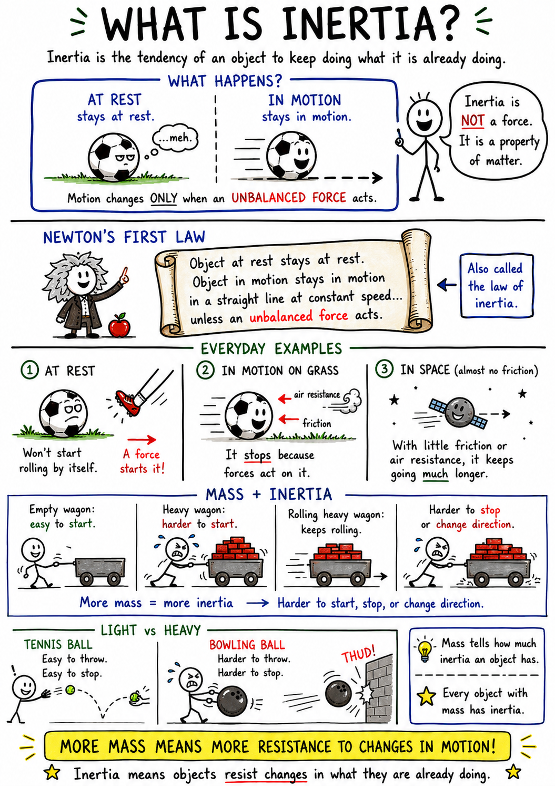

# Inertia

Imagine you are riding in a car with your seat belt fastened. The car is moving smoothly down the road. Suddenly, the driver brakes. Your body seems to lurch forward. Then, when the car starts again, you feel pressed backward into the seat.

Nothing strange has happened. You have just felt inertia.

Inertia is one of the most important ideas in the science of motion. It explains why moving objects tend to keep moving, why resting objects tend to stay still, why seat belts matter, why a heavy wagon is hard to start, and why a sliding hockey puck does not stop instantly.

Inertia is an object's resistance to changes in motion.

## What Is Inertia?

Inertia is the tendency of an object to keep doing what it is already doing.

An object at rest tends to stay at rest. An object in motion tends to keep moving in a straight line at a steady speed. Its motion changes only when an unbalanced force acts on it.

A soccer ball sitting on the grass will not start rolling by itself. It stays at rest until a force, such as a kick, acts on it. Once the ball is rolling, it does not stop because it "wants" to stop. It stops because forces such as friction from the grass and air resistance act against its motion.

Inertia is not a force. It is a property of matter. Every object with mass has inertia.

## Newton's First Law of Motion

Sir Isaac Newton described inertia in his first law of motion.

Newton's first law says that an object at rest stays at rest, and an object in motion stays in motion in a straight line at a constant speed, unless acted on by an unbalanced force.

This law is sometimes called the law of inertia.

At first, it may seem wrong. In everyday life, moving objects usually slow down. A rolling ball stops. A bicycle coasts to a halt. A sled slows on rough snow. But those objects stop because forces act on them. Friction and air resistance are always present on Earth.

If there were no friction and no air resistance, a moving object would keep moving much longer. In the empty space far from planets and stars, an object can coast for a very long time because there is little to slow it down.

## Mass and Inertia

Mass is the amount of matter in an object. Mass also tells us how much inertia an object has.

An object with more mass has more inertia. This means it is harder to start moving, harder to stop, and harder to change direction.

Think of an empty wagon and a wagon loaded with bricks. The empty wagon is easy to pull from rest. The loaded wagon is much harder to start moving because it has more mass and therefore more inertia. Once the loaded wagon is rolling, it is also harder to stop.

The same idea appears in sports. A tennis ball is easy to throw and easy to stop. A bowling ball is much harder to throw and much harder to stop because it has more mass.

More mass means more resistance to changes in motion.

## Inertia at Rest

Objects at rest tend to stay at rest.

A book on a desk does not slide across the room unless a force acts on it. A baseball on the ground stays there until someone picks it up, kicks it, or wind or another object moves it. A plate on a table stays still unless a hand, vibration, or other force changes its motion.

This is why a classic tablecloth trick can work. If a tablecloth is pulled very quickly from under dishes, the dishes tend to remain at rest because of inertia. If the cloth moves fast enough and friction is small enough, the dishes may stay nearly where they were.

The dishes are not choosing to stay still. Their inertia resists the sudden change in motion.

## Inertia in Motion

Objects in motion tend to stay in motion.

When you slide a book across a table, it keeps moving for a short time after your hand lets go. Then it slows and stops because friction acts on it. On a smoother surface, it slides farther. On ice, a hockey puck can slide a long distance because friction is small.

A moving object also tends to continue in a straight line. If you swing a small ball on a string and then let go, the ball does not keep circling. It flies off in a straight-line path at the moment it is released, because the string is no longer pulling it toward the center.

This straight-line tendency is part of inertia. To make an object turn, a force must change its direction.

## Seat Belts and Inertia

Seat belts are one of the most important everyday examples of inertia.

When a car is moving, your body is moving with it. If the car stops suddenly, your body tends to keep moving forward because of inertia. Without a seat belt, a passenger could be thrown forward into the dashboard, windshield, or seat in front.

A seat belt applies a force to slow your body down with the car. It spreads that force over stronger parts of the body and gives you a better chance of stopping safely.

This is also why loose objects in a car can be dangerous. If the car stops suddenly, a backpack, water bottle, or phone may keep moving forward. Inertia affects objects as well as people.

## Starting, Stopping, and Turning

Inertia makes changes in motion require force.

To start an object moving, a force must overcome its tendency to remain at rest. To stop a moving object, a force must overcome its tendency to keep moving. To turn an object, a force must change the direction of its motion.

The larger the mass, the more force is needed for the same change in motion. A small bicycle is easier to stop than a loaded truck. A ping-pong ball is easier to turn aside than a fast baseball. A light canoe is easier to push away from a dock than a large boat.

This is why drivers need more stopping distance at higher speeds and with heavier vehicles. Inertia does not disappear just because a driver wants to stop.

## Inertia and Friction

Inertia and friction often work against each other in everyday motion.

Inertia tends to keep a moving object moving. Friction tends to oppose motion between touching surfaces.

If you roll a ball across a carpet, inertia keeps the ball moving forward, but friction from the carpet slows it down. On a smooth floor, friction is smaller, so the ball rolls farther. On thick grass, friction is larger, so the ball stops sooner.

Air resistance is another force that opposes motion. A paper airplane slows because air pushes against it. A parachute works because air resistance greatly increases, helping slow a falling person.

Without friction and air resistance, inertia would be much easier to notice because moving objects would keep moving for a very long time.

## Inertia and Direction

Inertia is not only about starting and stopping. It is also about direction.

An object in motion tends to continue in a straight line. To make it turn, a force must act sideways.

When a car turns left, your body tends to keep moving in its original straight-line path. You may feel pushed toward the right side of the car, but what is really happening is that the car is turning while your body resists the change in direction. The seat and door push on you to make your body turn with the car.

A planet orbiting the Sun also shows this idea. Earth tends to move forward through space, while the Sun's gravity pulls it inward. The result is a curved path: Earth's orbit.

## Inertia in Sports

Sports are full of inertia.

A runner at the starting line must overcome inertia to begin the race. A football player sprinting downfield must use force to stop or change direction. A baseball player catching a fast ball must apply force to slow the ball to rest in the glove.

Inertia also explains why follow-through matters. When a tennis player swings a racket, the racket and arm are moving. A smooth follow-through helps manage that motion instead of stopping it suddenly. The same idea appears in throwing, batting, kicking, and golf.

Athletes learn to control inertia with strong muscles, good balance, and practice. They must start, stop, turn, and absorb forces safely.

## Inertia in Space

Space is an excellent place to understand inertia because there is very little friction.

If an astronaut pushes a tool in a spacecraft, the tool keeps moving until another force stops it. It may bump into a wall, be caught by a person, or be pulled by a tether. It does not simply drop to the floor because there may be no "floor" in the usual sense, and everything in orbit is falling around Earth together.

Mass still matters in space. A large equipment box may seem weightless, but it still has inertia. It may be difficult to start moving and difficult to stop. Astronauts must be careful with massive objects because they can drift with surprising force.

This shows an important truth: lower weight does not mean lower inertia. Inertia depends on mass, not on where the object is.

## Common Mistakes About Inertia

One common mistake is thinking that a force is needed to keep an object moving. On Earth, it often seems that way because friction and air resistance are always slowing things down. But without those opposing forces, an object in motion would keep moving at a steady speed in a straight line.

Another mistake is thinking that heavier objects have more inertia because they have more weight. Weight and mass are related on Earth, but inertia depends on mass. On the Moon, an object weighs less, but its mass and inertia are the same.

A third mistake is thinking that inertia is a kind of energy or a hidden push. It is not. Inertia is the resistance matter has to changes in motion.

## Why Inertia Matters

Inertia helps explain the motion of nearly everything around you. It explains why a resting ball stays still, why a moving skateboard keeps rolling, why passengers need seat belts, why heavy objects are harder to start and stop, and why planets follow curved paths under gravity.

It also teaches a powerful scientific habit: when motion changes, look for the force that caused the change. If motion does not change, forces may be balanced, or no unbalanced force may be acting.

The key lesson is simple: objects resist changes in motion. The more mass an object has, the more inertia it has. Once you understand inertia, Newton's laws, safety devices, sports, transportation, and space travel all become easier to understand.

## Study Questions

1. What is inertia?
2. Is inertia a force? Explain.
3. What does Newton's first law of motion say?
4. Why is Newton's first law sometimes called the law of inertia?
5. How are mass and inertia related?
6. Why is a loaded wagon harder to start moving than an empty wagon?
7. What does it mean that an object at rest tends to stay at rest?
8. What does it mean that an object in motion tends to stay in motion?
9. Why do moving objects usually slow down on Earth?
10. How do seat belts protect passengers using the idea of inertia?
11. Why can loose objects in a car be dangerous during a sudden stop?
12. Why does a heavier vehicle usually need more force or distance to stop?
13. How do friction and inertia affect a rolling ball?
14. Why does an object moving in a circle need a force to keep turning?
15. What happens when a ball on a string is released?
16. Why does inertia still matter in space?
17. Why does lower weight on the Moon not mean lower inertia?
18. Give two examples of inertia in sports.
19. What is one common mistake people make about inertia?
20. Give three examples of inertia affecting everyday life.
