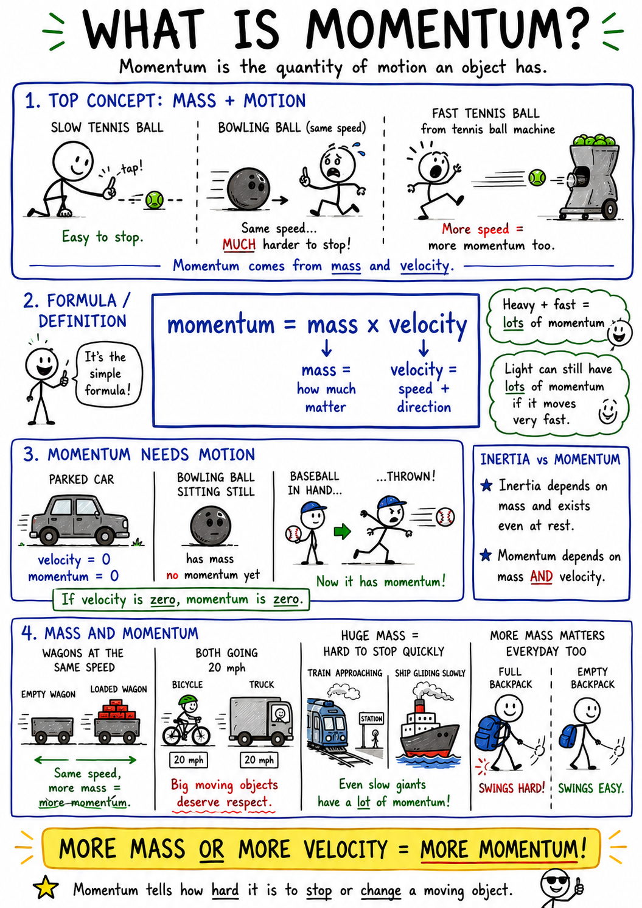

# Momentum

Imagine a tennis ball rolling slowly across the floor. You can stop it with one finger. Now imagine a bowling ball rolling at the same speed. You would not want to stop that with one finger. The two balls may be moving equally fast, but the bowling ball has much more mass, so it is much harder to stop.

Now imagine the tennis ball moving very fast, perhaps fired from a tennis ball machine. It is still not as massive as the bowling ball, but its speed now makes it harder to stop than before.

This combination of mass and motion is called momentum.

Momentum helps us understand collisions, sports, vehicle safety, rockets, billiard balls, football tackles, and why it matters whether a moving object is light or heavy, slow or fast.

## What Is Momentum?

Momentum is the quantity of motion an object has.

More precisely, momentum depends on two things:

1. The mass of the object.
2. The velocity of the object.

Velocity means speed in a particular direction. A moving object with more mass has more momentum. A moving object with more velocity also has more momentum.

Older students often write the formula this way:

**momentum = mass x velocity**

You do not need to solve difficult problems with this formula yet, but you should understand what it means. A heavy object moving slowly can have a lot of momentum. A light object moving very quickly can also have a lot of momentum.

## Momentum Needs Motion

An object must be moving to have momentum.

A parked car has mass, but if it is not moving, its momentum is zero. A bowling ball sitting still has mass and inertia, but it has no momentum until it begins to move. A baseball in a pitcher's hand has no momentum while it is at rest, but once it is thrown, it has momentum.

This is one difference between inertia and momentum. Inertia depends on mass and exists whether an object is moving or not. Momentum depends on both mass and velocity. If velocity is zero, momentum is zero.

Once an object is moving, its momentum tells us something important: how difficult it will be to stop or change that motion.

## Mass and Momentum

Mass affects momentum.

If two objects move with the same velocity, the object with more mass has more momentum. A loaded wagon rolling down a gentle slope has more momentum than an empty wagon moving at the same speed. A truck moving at 20 miles per hour has more momentum than a bicycle moving at 20 miles per hour.

This is why large moving objects deserve respect. A slow-moving ship can be very difficult to stop because it has enormous mass. A train moving through a station cannot stop instantly, even if the engineer applies the brakes, because the train's mass gives it great momentum.

Mass does not have to be enormous to matter. A full backpack swinging from your shoulder has more momentum than an empty backpack swinging at the same speed.

## Velocity and Momentum

Velocity also affects momentum.

If two objects have the same mass, the faster object has more momentum. A slowly rolled baseball is easy to catch. A fast pitch is much harder to catch because the baseball has more velocity and therefore more momentum.

Direction matters too. Momentum has direction because velocity has direction. A soccer ball moving north has northward momentum. If it is kicked south, its momentum changes direction.

Changing momentum requires force. To stop a moving object, speed it up, slow it down, or turn it, a force must act on it.

## Momentum and Force

Momentum changes when a force acts over time.

A small force acting for a long time can change momentum. A large force acting for a short time can also change momentum. This is why both the size of a force and the time during which it acts matter.

Think about catching a baseball. If you catch it with stiff hands, the ball stops very quickly, and the force on your hands can be painful. If you move your glove backward as the ball arrives, you increase the time it takes to stop the ball. The change in momentum is the same, but it happens over a longer time, so the force feels smaller.

This idea is important in safety design. Airbags, helmets, padded mats, and crumple zones in cars all help increase the time or distance over which a moving person or object slows down. Slowing down more gradually reduces the force.

## Collisions

A collision happens when objects hit each other.

Collisions are all about momentum. When a moving soccer ball hits your foot, the ball's momentum changes. When a bat hits a baseball, the bat changes the ball's momentum dramatically, often reversing its direction. When billiard balls collide, momentum can pass from one ball to another.

In a collision, forces come in pairs. If object A pushes on object B, object B pushes back on object A. This is Newton's third law of motion. The forces are equal in size and opposite in direction, but the results may look different if the objects have different masses.

For example, when a bat hits a baseball, the bat pushes on the ball, and the ball pushes back on the bat. The ball changes motion much more because it has much less mass than the bat and the player's arms.

## Conservation of Momentum

One of the most important rules in physics is the conservation of momentum.

In a closed system, the total momentum stays the same unless an outside force acts on it.

A closed system means we are considering a group of objects and ignoring outside forces, or outside forces are small enough not to matter for the moment. During a short collision between two carts on a smooth track, we might treat the carts as a system.

If one cart rolls into another, momentum may transfer from the first cart to the second. The first cart may slow down, and the second may speed up. The total momentum of the two carts together stays the same, as long as outside forces such as friction are small.

This does not mean each object keeps the same momentum. It means the total amount for the system is conserved.

## Recoil

Recoil is a good example of momentum conservation.

Imagine a person standing on a skateboard and throwing a heavy ball forward. The ball gains forward momentum. The person and skateboard roll backward. This backward motion happens because the total momentum of the system must be balanced.

The same idea helps explain how rockets move. A rocket pushes hot gases backward at high speed. The gases carry momentum backward, and the rocket gains momentum forward. The rocket does not need to push against air. It moves because of the momentum of the gases it throws backward.

This is one reason rockets can work in space.

## Momentum in Sports

Sports are full of momentum.

A football player running downfield has momentum because he has mass and velocity. A smaller player moving very fast may have a momentum similar to a larger player moving more slowly. Tackling safely requires controlling and changing momentum.

In baseball, the pitch has momentum, and the bat changes that momentum. In soccer, a powerful kick gives the ball momentum toward the goal. In hockey, a puck slides with momentum across the ice until friction, a stick, the boards, or a player changes it.

Good athletes learn to manage momentum. They bend their knees when landing, follow through when throwing, move their hands with a catch, and use body position to stop, turn, or redirect motion.

## Momentum and Safety

Momentum is central to safety.

A moving car has momentum. A faster car has more momentum than a slower car of the same mass. A heavier truck has more momentum than a lighter car at the same speed. To stop either vehicle, brakes must change its momentum.

At high speed, a vehicle has much more momentum, and stopping requires more force, more time, or more distance. This is why speeding is dangerous and why large vehicles need extra room to stop.

Seat belts, helmets, airbags, and padding do not make momentum disappear. Instead, they help manage the change in momentum. They spread forces over stronger parts of the body or increase the time over which the body slows down.

## Momentum in Everyday Life

You meet momentum whenever something is moving.

A shopping cart rolling down an aisle has momentum. The more loaded it is and the faster it moves, the harder it is to stop. A swinging backpack has momentum and can bump into people if you turn quickly. A sled sliding down a hill gains momentum as it speeds up.

Even water can have momentum. A slow stream is easy to step across. A rushing river can be dangerous because moving water has mass and velocity. Wind also has momentum. Strong winds can push trees, signs, and waves because moving air has mass and speed.

Momentum is not only for solid objects. Any moving matter can have momentum.

## Momentum and Direction

Because momentum depends on velocity, momentum has direction.

If two identical carts move toward each other at the same speed, their momenta are equal in size but opposite in direction. If they stick together after colliding, they may stop because the opposite momenta cancel.

If one cart is heavier or faster, the combined carts may move in the direction of the larger momentum after the collision.

Direction is why scientists must be careful with momentum. A number alone is not always enough. Knowing "how much" momentum matters, but knowing "which way" it acts matters too.

## Momentum in Space

Momentum is especially clear in space because there is little friction.

If an astronaut pushes a tool, the tool moves away, and the astronaut moves slightly in the opposite direction. The tool and astronaut exchange momentum. If the astronaut throws an object, the astronaut recoils backward.

Spacecraft use this principle. Rockets throw gas backward to move forward. Small thrusters release gas in carefully chosen directions to turn or adjust a spacecraft's path.

In space, nothing needs to push against the ground or air to move. Changing momentum by pushing matter one way can move a spacecraft the other way.

## Why Momentum Matters

Momentum joins two familiar ideas, mass and velocity, into one powerful concept. It helps answer the question: how much motion does this object have, and how hard will it be to change?

Momentum explains why a fast baseball stings your hand, why a loaded cart is harder to stop, why trucks need more stopping distance, why helmets and airbags protect people, why billiard balls transfer motion, and why rockets can travel through space.

The key lesson is this: momentum depends on mass and velocity. To change momentum, a force must act. In many collisions and interactions, momentum is not lost; it is transferred from one object to another or shared within a system.

Once you understand momentum, moving objects become easier to read. You can look at a rolling cart, a thrown ball, a running player, or a rocket launch and ask: how much mass, how much velocity, and which direction?

## Study Questions

1. What is momentum?
2. What two quantities does momentum depend on?
3. What is the basic formula for momentum?
4. Why does a parked car have no momentum even though it has mass?
5. How is momentum different from inertia?
6. If two objects move with the same velocity, which one has more momentum?
7. If two objects have the same mass, which one has more momentum?
8. Why does direction matter when describing momentum?
9. What must happen for an object's momentum to change?
10. How can moving your glove backward while catching a ball reduce the force on your hand?
11. What is a collision?
12. How does Newton's third law apply during a collision?
13. What does conservation of momentum mean?
14. Does conservation of momentum mean each object keeps the same momentum? Explain.
15. What is recoil?
16. How does momentum help explain rocket motion?
17. Why does a faster car have more momentum than the same car moving slowly?
18. How do seat belts, airbags, helmets, or padding help manage momentum?
19. Give two examples of momentum in sports.
20. Give three examples of momentum affecting everyday life.
